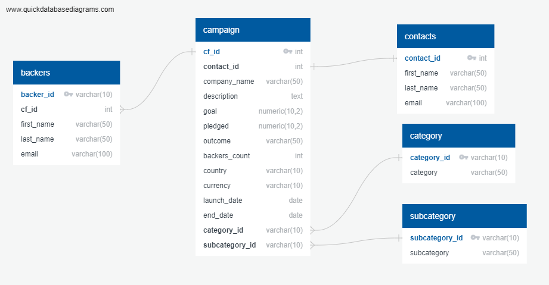

# Crowdfunding-ETL

## ## 1. Overview of the analysis:
Independent Funding has been growing, would like to move the data from one large Excel file onto a PostgreSQL database. With this it will become more easy to the analytics team to be able to perform analysis and create reports for company stakeholders as well as individuals who donate to projects.

## ERD diagram:
 